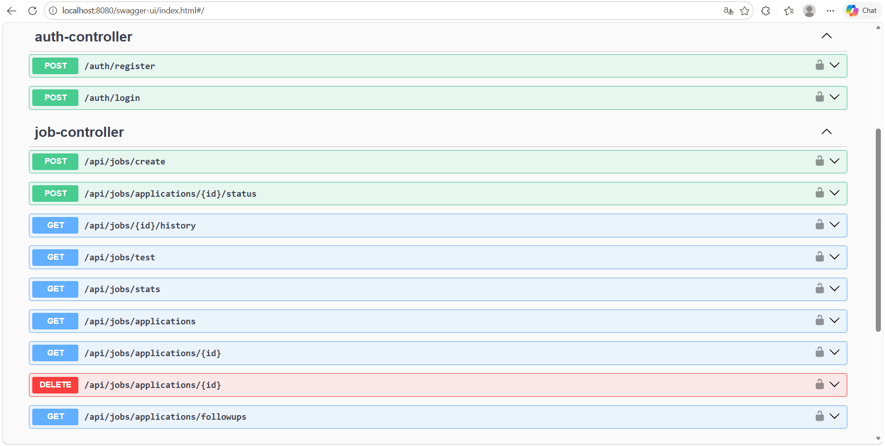
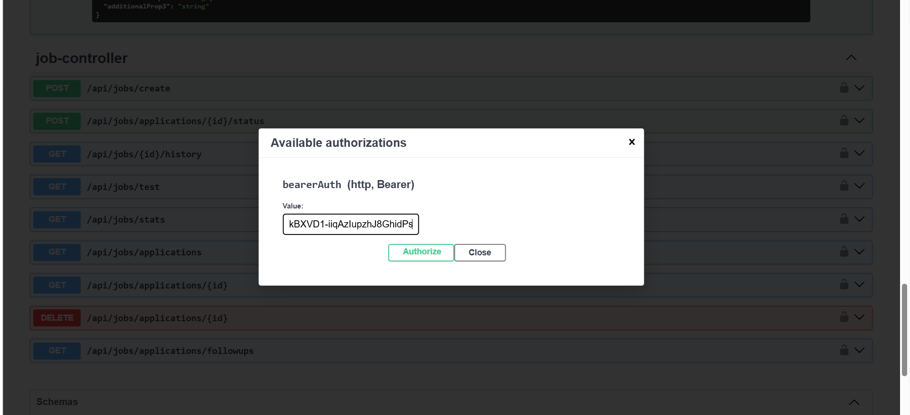
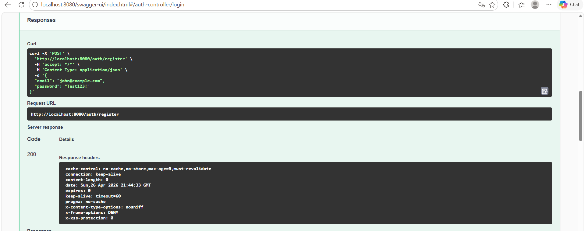
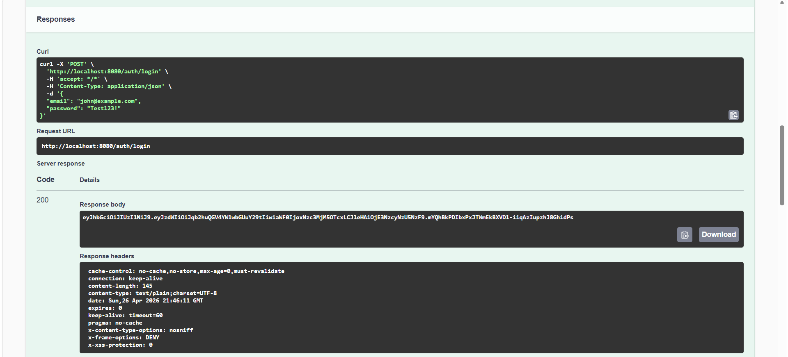
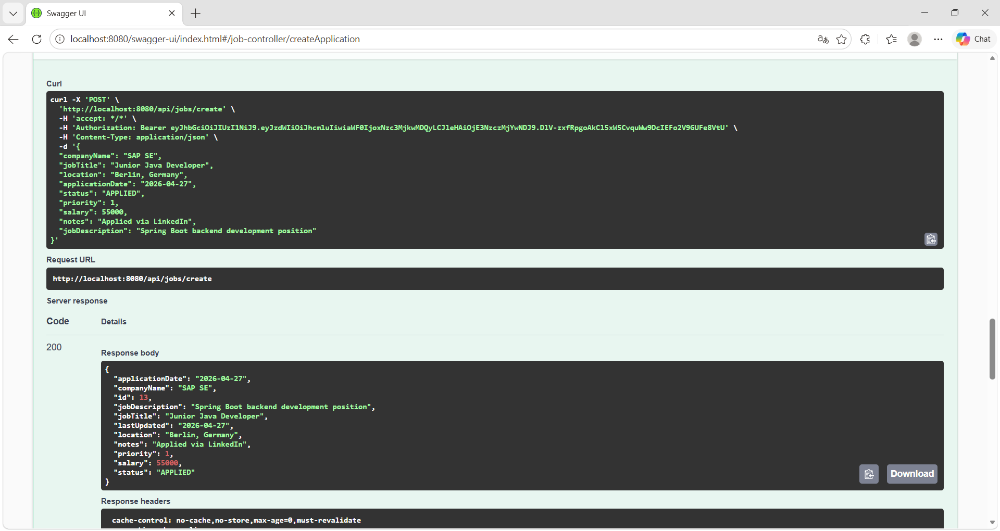
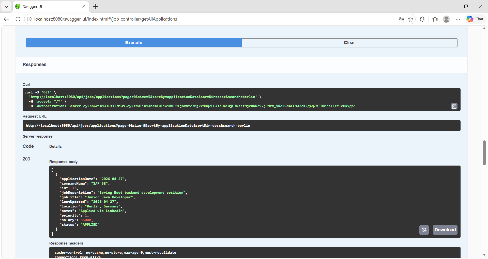

  # Job Application Tracker API

A secure REST API built with Spring Boot for tracking job applications. Features JWT authentication, multi-user data isolation, status history, follow-up reminders, and statistics — fully containerized with Docker.

---

## Tech Stack


- **Java 17**
- **Spring Boot**
- **Spring Security + JWT**
- **Spring Data JPA + Hibernate**
- **MySQL 8**
- **Docker + Docker Compose**
- **Swagger / OpenAPI 3**
- **JUnit 5 + MockMvc**
- **Lombok**

---

## Features

- User registration & login with JWT authentication
- Multi-user data isolation
- CRUD operations for job applications
- Search, filtering, sorting & pagination
- Status history tracking per application
- Follow-up reminder system
- Statistics & funnel metrics (interview rate, acceptance rate)
- Global exception handling
- Fully documented REST API via Swagger UI

---

## API Preview

### Swagger UI — All Endpoints


### JWT Authorization


### Register & Login Flow



### Create & Retrieve Applications



---

## 🐳 Running with Docker

### Prerequisites
- [Docker Desktop](https://www.docker.com/products/docker-desktop/) installed and running

### Setup

**1. Clone the repository**
```bash
git clone https://github.com/arintasoglu/job-application-tracker-api.git
cd job-application-tracker-api/JobTrackerBackend
```

**2. Create your `.env` file**


Open `.env` and set your values:
```env
DB_PASSWORD=yourpassword
JWT_SECRET=anyRandomStringAtLeast32CharactersLong
```

**3. Start the application**
```bash
docker-compose up --build
```

**4. Open Swagger UI**
```
http://localhost:8080/swagger-ui/index.html
```

> MySQL database is created automatically. No local MySQL installation needed.

---

## Running Locally (without Docker)

**1. Configure `application.properties`**
```properties
spring.datasource.url=jdbc:mysql://localhost:3306/java16
spring.datasource.username=root
spring.datasource.password=your_password
security.jwt.secretKey=your_secret_key
```

**2. Run**
```bash
mvn spring-boot:run
```

---

## Authentication Flow

### 1. Register
```
POST /auth/register
```
```json
{
  "email": "john@example.com",
  "password": "Test123!"
}
```

### 2. Login — returns JWT token
```
POST /auth/login
```

### 3. Authorize in Swagger UI
Click the **Authorize 🔒** button and enter:
```
Bearer <your_token>
```

### 4. Access protected endpoints
All `/api/jobs/**` endpoints require a valid JWT token.

---

## Core Endpoints

| Method | Endpoint | Description |
|--------|----------|-------------|
| POST | `/auth/register` | Register new user |
| POST | `/auth/login` | Login & get JWT token |
| POST | `/api/jobs/create` | Create job application |
| GET | `/api/jobs/applications` | Get all applications (paginated) |
| GET | `/api/jobs/applications/{id}` | Get application by ID |
| POST | `/api/jobs/applications/{id}/status` | Update application status |
| GET | `/api/jobs/{id}/history` | Get status history |
| DELETE | `/api/jobs/applications/{id}` | Delete application |
| GET | `/api/jobs/stats` | Get statistics |
| GET | `/api/jobs/applications/followups` | Get follow-up reminders |

---

## Architecture

```
Controller  →  Service  →  Repository  →  MySQL
                ↑
           Security (JWT Filter + UserDetailsService)
                ↑
           Global Exception Handler
```

Layered architecture with DTO-based API contract and full separation of concerns.

---

## What This Project Demonstrates

- Secure backend development with Spring Security
- Stateless JWT authentication
- RESTful API design best practices
- Database modeling with JPA/Hibernate
- Docker containerization with multi-stage builds
- Integration testing with MockMvc
- Clean architecture principles
- Real-world business logic

